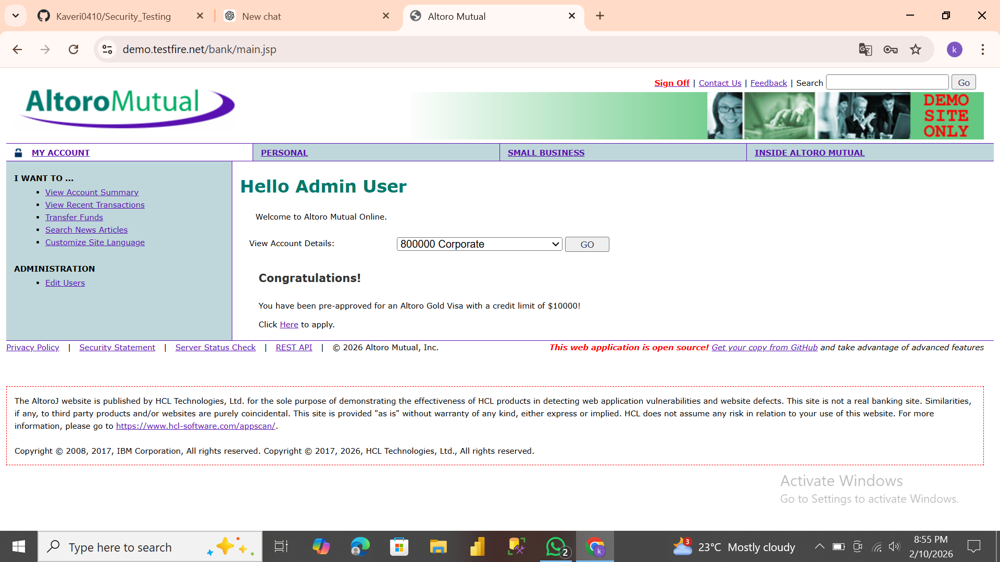
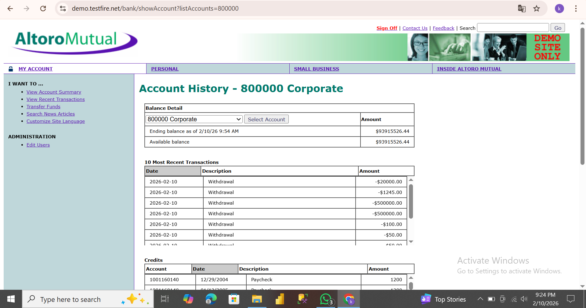
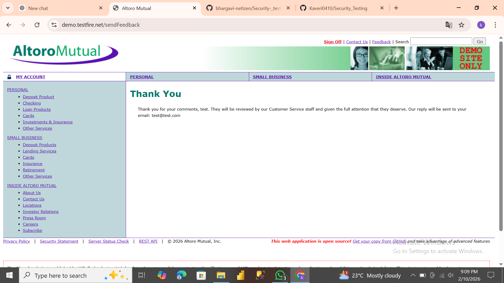
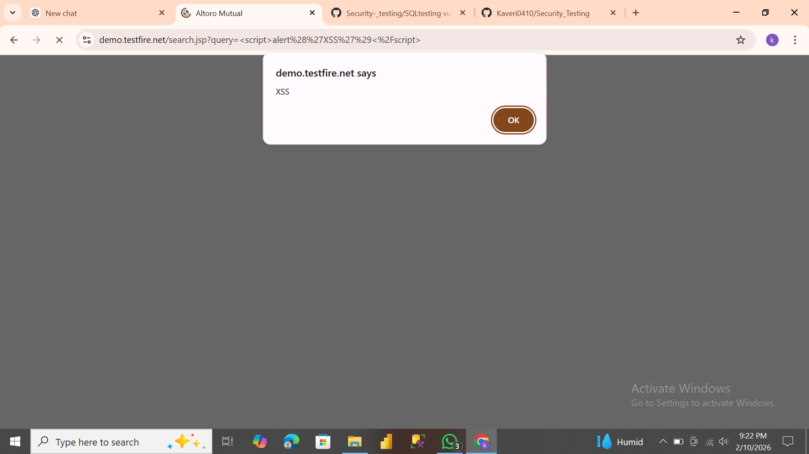

### Security-_testing
"Company": CODETECH IT SOLITIONS

"Name": Katikala Kaveri

"INTERN ID": CTIS5250

"DOMAIN": SOFTWARE TESTING

"DURATION": 4WEEKS

"MENTOR": NEELA SANTHOSH

**PROJECT TITLE**: Web Application Security Testing

**DESCRIPTION**: This project focuses on conduct basic security testing on a sample web application to identify commomn vulnerabilities such as SQL Injection and Cross-site-Scripting(XSS.)

The Testing was performed on an intentionally vulnerable demo web application for learning and ethical testing purpose.

**OBJECTIVE**:

Identify security vulnerabities in a web application.
Understand common web security risks.
Document findings and mitigation strategies.
TESTED APPLICTAIONS: https://demo.testfire.net/

**TESTING TYPE**: Manual Security Testing.

**VULNARABILITIES TESTED**: 1.SQL Injection. 2.CRoss-Site-Scripting(XSS).

**TOOLS USED**:

Web Browser(Google Chrome).
Visual Studio Code(for documentation).
**DELIVERABLES**:

Security_Testing_Report.txt (Detailed security report)
RESULTS: The application was found to be vulnerable to SQL Injection and XSS. Appropriate mitigation strategies have been documented in the security report.

**DISCLAIMER**: This testing was conducted only for educational purpose on a legally permitted demo application

---

## 📸 Screenshots Evidence

### 🔴 SQL Injection Testing

**SQL Injection Attempt**

**SQL Injection Vulnerable Result**

---

### 🔴 Cross-Site Scripting (XSS) Testing

**XSS Input Attempt**

**XSS Vulnerable Output**

